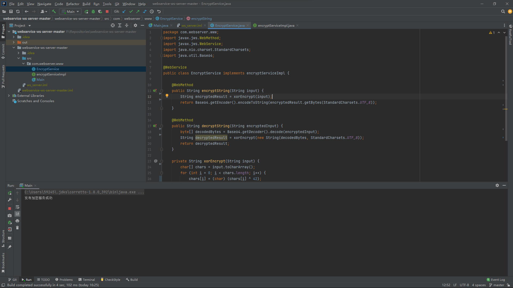
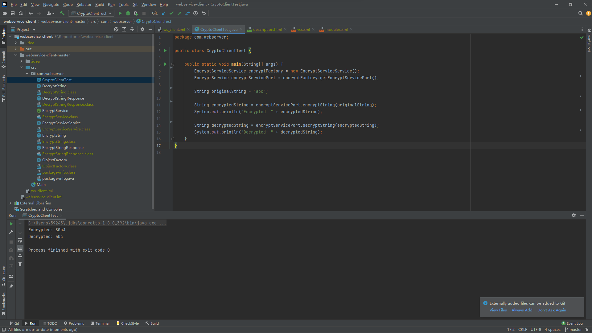
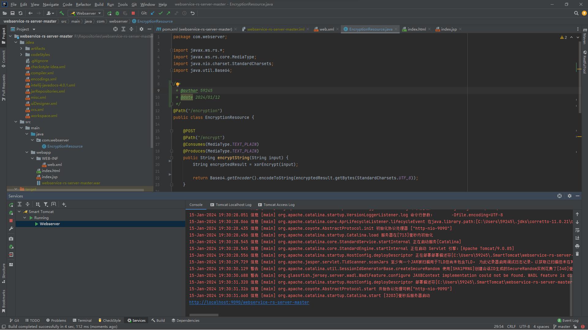
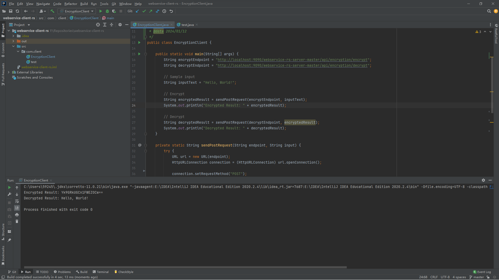

# Webservice project(2023-2024)
*for WS_Mini Projet- Fall 2023* 

URL:
[https://github.com/Noob-coucou/WebService](https://github.com/Noob-coucou/WebService)

___
### Réalisé par: 
- BD202 1201024042 Isidore 郭志强 592459595@qq.com
- BD202 1201024058 Hugo 俞佳睿
- BD202 1201024059 Basile 金禹辰
___
Ce projet vise à effectuer des opérations de cryptage et de décryptage sur une chaîne spécifiée, en utilisant actuellement l'algorithme XOR. Avec ce projet, l'utilisateur peut crypter et décrypter des chaînes de caractères en suivant les étapes suivantes :

1. encryptString :
L'utilisateur peut appeler la méthode encryptString et lui transmettre la chaîne à crypter. Actuellement, la méthode crypte la chaîne d'entrée à l'aide de l'algorithme XOR.
2. decryptString :
L'utilisateur peut appeler la méthode decryptString, transmettre la chaîne cryptée codée en Base64 à la méthode et renvoyer la chaîne originale décryptée.

Le projet utilise deux méthodes pour construire le webservice :

### Basé sur Jax-ws

### Basé sur Jax-RS(Jersey)

Les fichiers wsdl se trouvent dans le dossier files sur github.
